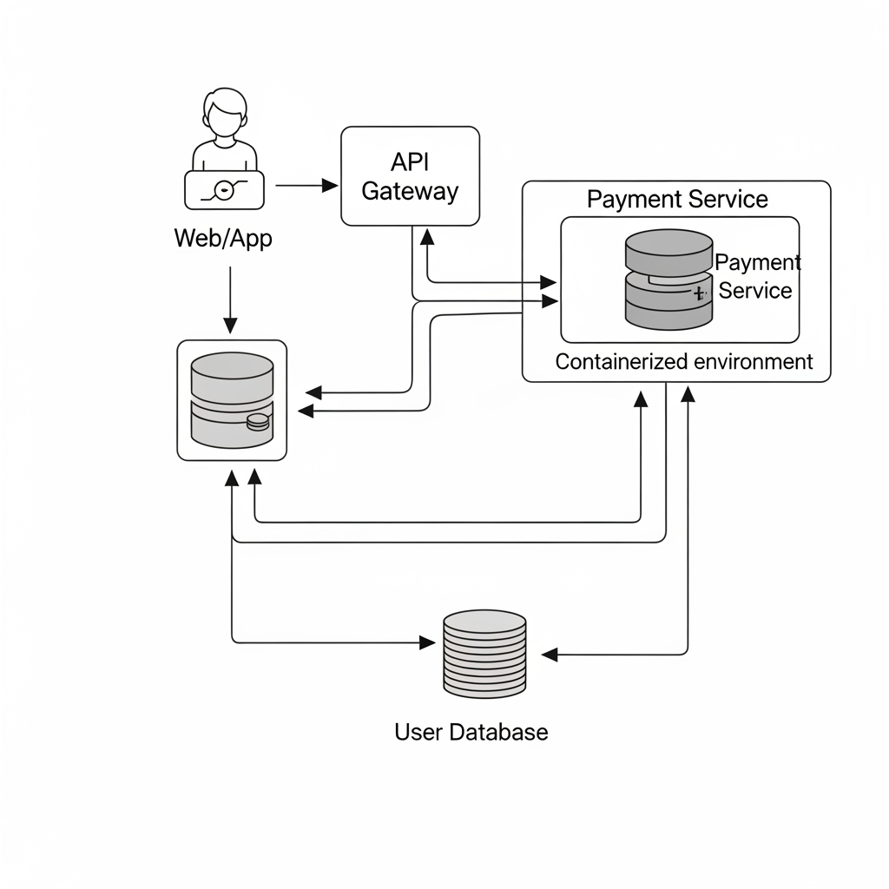

# 프로젝트: DevSecOps 파이프라인을 통한 MSA 기반 '간편결제 API' 서비스 구축

## 1. 프로젝트 개요

### 1.1. 가상 회사 및 서비스
- **회사명**: SecurePay (시큐어페이)
- **서비스**: 외부 제휴사(쇼핑몰 등)가 연동하여 사용할 수 있는 MSA 기반의 '간편결제 API' 서비스
- **주요 기능**: 사용자 인증, 카드 등록, 결제 요청 및 처리, 거래 내역 조회

### 1.2. 기술 목표
- **DevSecOps 구현**: 개발(Dev), 보안(Sec), 운영(Ops)이 통합된 자동화 파이프라인을 구축하여 빠르고 안전한 배포 환경을 조성합니다.
- **클라우드 네이티브**: Docker, Kubernetes 등 클라우드 네이티브 기술을 활용하여 높은 가용성과 확장성을 확보합니다.
- **보안 내재화**: 설계 단계부터 위협 모델링을 적용하고, 파이프라인 각 단계에 자동화된 보안 테스트를 통합하여 보안을 내재화(Security by Design)합니다.

## 2. 위협 모델링 및 아키텍처

### 2.1. 데이터 흐름도 (Data Flow Diagram)

### 2.2. 위협 분석 (STRIDE 모델)

| 위협 유형 | 위협 시나리오 예시 | 대응 전략 (Mitigation) |
| :--- | :--- | :--- |
| **S**poofing (스푸핑) | 악의적인 서비스가 우리 결제 API인 척 위장하여 통신 시도 | 서비스 간 상호 인증(mTLS) 도입, 사용자 인증을 위한 JWT 토큰 사용 |
| **T**ampering (변조) | 공격자가 결제 요청 금액을 중간에서 1,000원에서 100원으로 변경 | 모든 통신 구간에 TLS 암호화 적용, 중요한 데이터에 대한 전자 서명 사용 |
| **R**epudiation (부인) | 사용자가 '결제한 적 없다'고 주장하거나, 시스템이 '결제 요청을 받은 적 없다'고 부인 | 모든 API 요청/응답 및 중요 시스템 이벤트를 CloudTrail/CloudWatch에 기록하여 감사 추적성 확보 |
| **I**nformation Disclosure (정보 유출) | DB에 저장된 카드 정보나 소스코드 내 비밀 키 유출 | 중요 DB는 Private Subnet에 배치 및 암호화, AWS Secrets Manager 또는 Parameter Store를 통한 비밀 관리 |
| **D**enial of Service (서비스 거부) | 비정상적인 트래픽을 대량으로 보내 API 서버를 마비시킴 | API Gateway에 Rate Limiting(요청 수 제한) 설정, AWS WAF를 이용한 악성 트래픽 필터링 |
| **E**levation of Privilege (권한 상승) | 일반 사용자가 관리자 권한을 탈취하여 모든 사용자 정보에 접근 | IAM 역할에 최소 권한 원칙(Least Privilege) 적용, 컨테이너는 root 권한이 아닌 일반 유저 권한으로 실행 |
